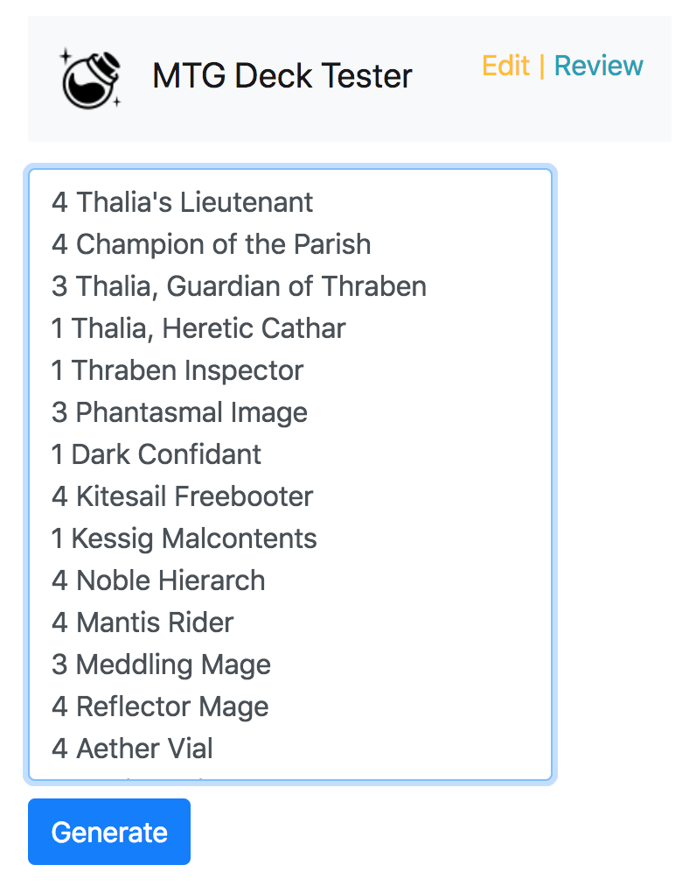
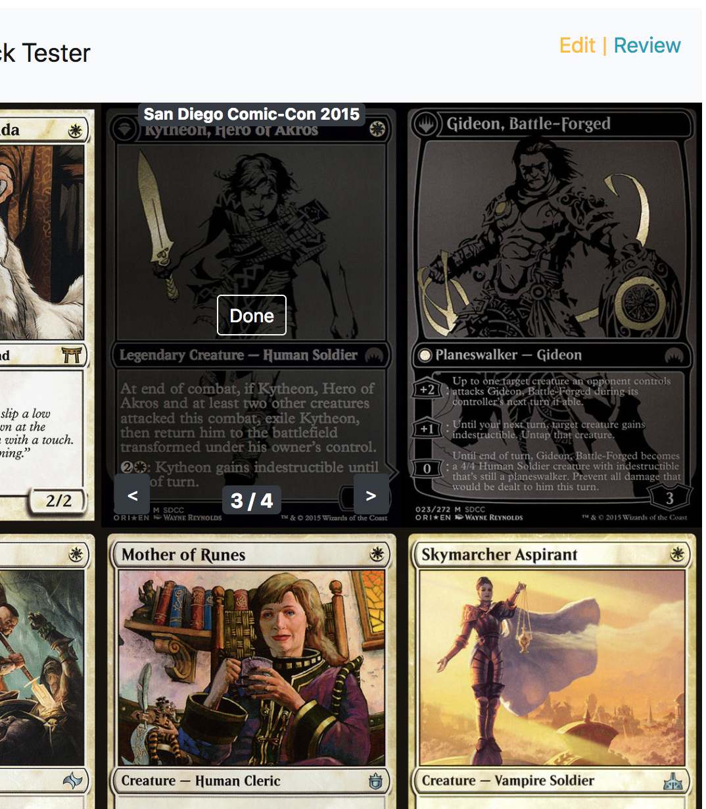

# MTG-Proxy-Generator
## Try the Live App Below:
[MTG Proxy-Generator](https://philo-jh.github.io/MTG-Proxy-Generator/)
## Syntax:
MTGO Format:  
Black Lotus   
4 Counterspell

## Flags:
Checklist (-cl)
Jace, Vryn's Prodigy -cl (creates a single-sided split-card style checklist card)

## How to Use:
Ever wondered how your deck would play if you just had those couple of cards? Now you can try them out before you buy with MTG Proxy-Generator! Create proxy versions of cards or even decks to playtest before purchasing. Just enter a list in MTGO format with one card name per line. You can then print them out 9 on a page and insert them over other cards in sleeves to playtest.
## Import Decks Using Easy MTGO Syntax

## Create Proxy-Versions of Decks You'd Like to Test

## Choose Whatever Print Your Heart Desires!

## Technology Used:
This app was built with HTML, CSS, Javascript, jQuery, and Bootstrap. Thanks to the awesome ScryFall API for the database!
